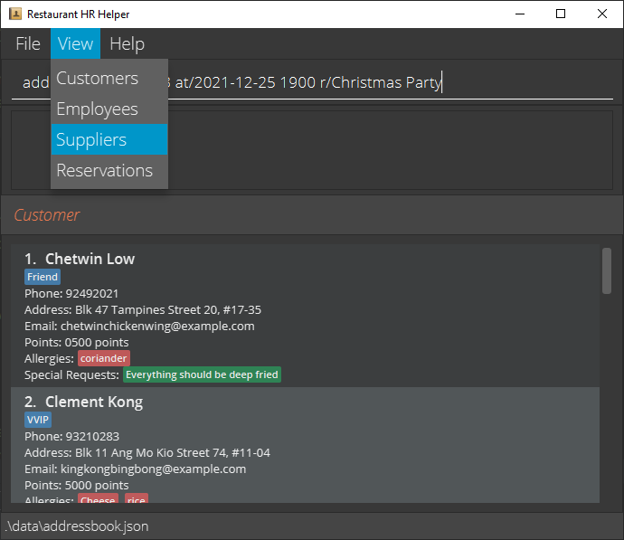

Restaurant HR Helper (RHRH) is a **desktop app for managing restaurant contacts including employees, suppliers and customers, optimized for use via a Command Line Interface** (CLI) while still having the benefits of a Graphical User Interface (GUI). If you can type fast, RHRH can get your contact management tasks done faster than traditional GUI apps.

- Table of Contents
- {:toc}

---

## Getting Started

### Before using this User Guide

Here are some important syntax which are used throughout this document:

**:information_source: Notes:** 
Useful information or tips are displayed here

**:bangbang:Warning!** 
Dangerous or potentially negative actions are displayed here

### Quick Start

1. Ensure you have Java `11` or above installed in your Computer.

2. Download the latest `rhrh.jar` from [here](https://github.com/AY2122S1-CS2103T-T17-1/tp/releases).

3. Copy the file to the folder you want to use as the _home folder_ for your RHRH.

4. Double-click the file to start the app. The GUI similar to the below should appear in a few seconds. Note how the app contains some sample data.   
   

5. Type the command in the command box and press Enter to execute it. e.g. typing **`help`** and pressing Enter will open the help window.   
   Some example commands you can try:

   - `addC` : Add a customer
   - Format: `addcustomer n/NAME p/PHONE_NUMBER e/EMAIL a/ADDRESS lp/LOYALTYPOINTS [alg/ALLERGIES] [sr/SPECIALREQUESTS] [t/TAG]...`
   - Example: `addC customer n/John Doe p/87654321 e/e12345@u.nus.edu a/Clementi lp/1000`

6. Refer to the [Features](#features) below for details of each command.

### Command syntax

Commands in RHRH has the syntax: `COMMAND_WORD + [PREAMBLE] + [PREFIX + PARAMETER]...`, where:

- `COMMAND_WORD` is a word that specifies a action of the command, e.g. `addC` for adding a customer, `deleteR` for deleting a reservation.
- `PREAMBLE` is the text before the first valid prefix, usually a positive number (for delete, edit or add reservation commands), or a phrase (for find commands).
- `PREFIX` is a keyword to recognize the beginning of a `PARAMETER`, usually ends with a `'/'` by convention.
- `PARAMETER` is an argument input by user. `PREAMBLE` is also a kind of `PARAMETER`. A command can have 0 or more `PARAMETER`s, which can be compulsory or optional.

Example: `addr 2 p/98765432 at/2021-12-24 2000`

- `addr` is a `COMMAND_WORD` that specifies the action of adding a new reservation.
- `2` is an `PREAMBLE` that specifies number of people.
- `p/`, `at/` are prefixes for phone and date-time, respectively.
- `2`, `98765432` and `2021-12-24 2000` are `PARAMETER`s

This is the list of all prefixes used in RHRH, as well as their corresponding parameter constraints:

| Prefix | Description         | Parameter constraints                             |
| :----: | ------------------- | ------------------------------------------------- |
|  `n/`  | Name                |
|  `p/`  | Phone               |
|  `a/`  | Address             |
|  `e/`  | Email               |
| `lp/`  | Loyalty Point       |
| `alg/` | Allergy             |
| `sr/`  | Special Request     |
|  `t/`  | Tag                 |
|  `l/`  | Leaves              |
| `jt/`  | Job Title           |
| `sal/` | Salary              |
| `st/`  | Supply Type         |
| `dd/`  | Delivery Details    |
| `at/`  | Reserving Date Time | Format: `yyyy-MM-dd HHmm`, e.g. `2021-12-24 2000` |
|  `r/`  | Remark              | Contains alphanumeric characters                  |

---

## Features

**:information_source: Notes about the command format:** 

- Command words are case-insensitive, i.e. `addC` and `AdDc` are the same

- Words in `UPPER_CASE` are the parameters to be supplied by the user. 
  e.g. in `add customer n/NAME`, `NAME` is a parameter which can be used as `add n/John Doe`.

- Items in square brackets are optional. 
  e.g `n/NAME [t/TAG]` can be used as `n/John Doe t/friend` or as `n/John Doe`.

- Items with `…`​ after them can be used multiple times including zero times. 
  e.g. `[t/TAG]…​` can be used as ` ` (i.e. 0 times), `t/friend`, `t/friend t/family` etc.

- Parameters can be in any order. 
  e.g. if the command specifies `n/NAME p/PHONE_NUMBER`, `p/PHONE_NUMBER n/NAME` is also acceptable.

- If a parameter is expected only once in the command but you specified it multiple times, only the last occurrence of the parameter will be taken. 
  e.g. if you specify `p/12341234 p/56785678`, only `p/56785678` will be taken.

- Extraneous parameters for commands that do not take in parameters (such as `help`, `list`, `exit` and `clear`) will be ignored. 
  e.g. if the command specifies `help 123`, it will be interpreted as `help`.

### Viewing help: `help`

Shows a message explaining how to access the help page.

Format: `help`

<!--
  #######################
  Customer commands here
  #######################
-->

### Adding a customer: `addC`

Format: `addcustomer n/NAME p/PHONE_NUMBER e/EMAIL a/ADDRESS lp/LOYALTYPOINTS [alg/ALLERGIES] [sr/SPECIALREQUESTS] [t/TAG]…`

- Adds a customer with all specified fields, where `LOYALTYPOINTS`, `ALLERGIES` and `SPECIALREQUESTS` are fields specific to customers.
- `ALLERGIES`, `SPECIALREQUESTS` and `TAG` are optional fields that can be omitted.

Examples:

- `addcustomer n/John Doe p/87654321 e/e12345@u.nus.edu a/Blk 20 Sengkang Ave 10 lp/0 alg/Kiwi sr/NoAirCon t/friendly` adds a customer with the respective fields to the customer list.
- `addcustomer n/John Doe p/87654321 e/e12345@u.nus.edu a/Blk 20 Sengkang Ave 10 lp/0` adds a customer with the respective fields to the customer list.

### Deleting a customer : `deleteC`

Deletes the specified customer from RHRH.

Format: `deleteC INDEX`

- Deletes the customer at the specified `INDEX`.
- The index refers to the index number shown in the displayed customer list.
- The index **must be a positive integer** 1, 2, 3, …​

Examples:

- `deleteC 2` deletes the 2nd customer in the address book.

### Editing a customer : `editC`

Edits an existing customer in RHRH.

Format: `editC INDEX [n/NAME] [p/PHONE] [e/EMAIL] [a/ADDRESS] [alg/ALLERGIES] [sr/SPECIALREQUESTS] [t/TAG]…​`

- Edits the customer at the specified `INDEX`. The index refers to the index number shown in the displayed customer list. The index **must be a positive integer** 1, 2, 3, …​
- At least one of the optional fields must be provided.
- Existing values will be updated to the input values.
- When editing allergies, special requests or tags, the existing tags of the person will be removed i.e adding of tags is not cumulative.
- You can remove all the person’s tags by typing `t/` without
  specifying any tags after it. Similar for allergies by typing `alg/` and special requests by typing `sr/`.

Examples:

- `editcustomer 1 alg/Kiwi sr/noAirCon` Edits the allergies and special requests of the 1st customer to be `Kiwi` and `noAirCon` respectively.
- `editcustomer 2 n/Betsy Crower t/` Edits the name of the 2nd customer to be `Betsy Crower` and clears all existing tags.

<!--
  #######################
  Employee commands here
  #######################
-->

### Adding an employee: `addE`

Adds an employee to RHRH.

Format: `addE n/NAME p/PHONE_NUMBER e/EMAIL a/ADDRESS l/LEAVES sal/SALARY jt/JOBTITLE [t/TAG]…`

- Adds an employee with all specified fields, where `LEAVES`, `SALARY` and `JOBTITLE` are fields specific to employees.
- `TAG` is an optional field that can be omitted.

Examples:

- `addemployee n/John Doe p/87654321 e/e12345@u.nus.edu a/Blk 20 Sengkang Ave 10 l/14 sal/4000 jt/Junior Developer t/workaholic` adds an employee with the respective fields.
- `addemployee n/John Doe p/87654321 e/e12345@u.nus.edu a/Blk 20 Sengkang Ave 10 l/14 sal/4000 jt/Junior Developer` adds an employee without any optional fields.

### Deleting an employee : `deleteE`

Deletes the specified employee from RHRH.

Format: `deleteE INDEX`

- Deletes the employee at the specified `INDEX`.
- The index refers to the index number shown in the displayed employee list.
- The index **must be a positive integer** 1, 2, 3, …​

Examples:

- `deleteE 2` deletes the 2nd person in the address book.

### Editing an employee : `editE`

Edits an existing employee in RHRH.

Format: `editE INDEX [n/NAME] [p/PHONE] [e/EMAIL] [a/ADDRESS] [l/LEAVES] [sal/SALARY] [jt/JOBTITLE] [t/TAG]…​`

- Edits the employee at the specified `INDEX`. The index refers to the index number shown in the displayed employee list. The index **must be a positive integer** 1, 2, 3, …​
- At least one of the optional fields must be provided.
- Existing values will be updated to the input values.
- When editing tags, the existing tags of the employee will be removed i.e adding of tags is not cumulative.
- You can remove all the employee’s tags by typing `t/` without
  specifying any tags after it.

Examples:

- `editE 1 sal/4000` Edits the salary of the 1st employee to be `4000`.
- `editE 2 n/Betsy Crower t/` Edits the name of the 2nd employeee to be `Betsy Crower` and clears all existing tags.

<!--
  #######################
  Supplier commands here
  #######################
-->

### Adding a supplier: `addS`

Adds a supplier to RHRH.

Format: `addS n/NAME p/PHONE_NUMBER e/EMAIL a/ADDRESS st/SUPPLYTYPE dd/DELIVERYDETAILS [t/TAG]…`

- Adds a supplier with all specified fields, where `SUPPLYTYPE` and `DELIVERYDETAILS` are fields specific to suppliers
- `TAG` is an optional field that can be omitted.

Examples:

- `addS n/John Doe p/87654321 e/e12345@u.nus.edu a/Blk 20 Sengkang Ave 10 st/Alcohol dd/Every Monday t/punctual` adds a supplier with the respective fields.
- `addS n/John Doe p/87654321 e/e12345@u.nus.edu a/Blk 20 Sengkang Ave 10 st/Alcohol dd/Every Monday` adds a supplier without any optional fields.

### Deleting a supplier : `deleteS`

Deletes the specified supplier from RHRH.

Format: `deleteS INDEX`

- Deletes the supplier at the specified `INDEX`.
- The index refers to the index number shown in the displayed supplier list.
- The index **must be a positive integer** 1, 2, 3, …​

Examples:

- `deleteS 2` deletes the 2nd supplier displayed on the Ui.

### Editing a supplier : `editS`

Edits an existing supplier in RHRH.

Format: `editS INDEX [n/NAME] [p/PHONE] [e/EMAIL] [a/ADDRESS] [st/SUPPLYTYPE] [dd/DELIVERYDETAILS] [t/TAG]…​`

- Edits the supplier at the specified `INDEX`. The index refers to the index number shown in the displayed supplier list. The index **must be a positive integer** 1, 2, 3, …​
- At least one of the optional fields must be provided.
- Existing values will be updated to the input values.
- When editing tags, the existing tags of the supplier will be removed i.e adding of tags is not cumulative.
- You can remove all the supplier’s tags by typing `t/` without
  specifying any tags after it.

Examples:

- `editS 1 p/91234567 st/Beef` Edits the phone number and supply type of the 1st supplier to be `91234567` and `Beef` respectively.
- `editS 2 n/Betsy Crower t/` Edits the name of the 2nd supplier to be `Betsy Crower` and clears all existing tags.

<!--
  #######################
  Reservation commands here
  #######################
-->

### Searching for reservation's made: `check`

Displays the reservations made at the specified date and/or time

Format:

- `check DATE TIME`: Returns all reservations on `DATE TIME`
- `check DATE`: Returns all reservations on `DATE`, for **all timings**
- `check TIME`: Returns all reservations on **today's date**, at `TIME`
  - `DATE` is formatted as `yyyy-MM-dd`
  - `TIME` is formatted as `HH00`

Examples:

- `check 2021-09-19 1800`
- `check 2021-09-19`
- `check 1800`

:information_source: **Notes:** 

- Time has to be formatted on the hour (i.e. minutes of the time is **00**)

### Setting the tables for the restaurant: `settables`

:bangbang: **Warning!** 
This command will remove **ALL** reservations and overwrite previously set tables  

Sets the tables with the sizes specified so that reservations can be made

Format: `settables LIST_OF_TABLE_SIZES`

- `LIST_OF_TABLE_SIZES` is formatted as any combination of the following:
  - **(size of one table)**
  - **(size of one table)x(number of tables with this size)**, 
    each comma-separated from the next.

Examples:

- `settables 10,8,8,4,4,2x6,1x4`

:information_source: **Notes:** 

- Size of tables and Number of tables with specified size has to be a positive integer

### Adding a reservation: `addr`

Add a new reservation with number of people,
customer's phone number and the date & time.

Format: `addr NUMBER_OF_PEOPLE p/PHONE at/DATE_TIME [r/REMARK] [t/TAG]…`

- Date-time format is `yyyy-MM-dd HH00`, e.g. `2021-11-11 2000`

Examples:

- `addr 2 p/98765432 at/2021-12-24 2000 r/birthday party t/20PercentOff`
- `addr 5 p/12345668 at/2021-02-14 1200 r/have kids`

:information_source: **Notes:** 

- Tables must be set before reservations can be made. See [settables](#setting-the-tables-for-the-restaurant-settables)

- Phone number has to be a valid phone number from a customer in the database

- Time has to be formatted on the hour (i.e. minutes of the time is **00**)

### Deleting a reservation

Deletes the specified reservation from RHRH.

Format: `deleteR INDEX`

- Deletes the supplier at the specified `INDEX`.
- The index refers to the index number shown in the displayed supplier list.
- The index **must be a positive integer** 1, 2, 3, …​

Examples:

- `deleteR 2` deletes the 2nd reservation displayed on the Ui.

### Editing a reservation

Edits an existing reservation in RHRH.

Format: `editR INDEX [r/REMARK] [t/TAG]…`

- Edits the reservation at the specified `INDEX`. The index refers to the index number shown in the displayed reservation list. The index **must be a positive integer** 1, 2, 3, …​
- At least one of the optional fields must be provided.
- Existing values will be updated to the input values.
- When editing tags, the existing tags of the supplier will be removed i.e adding of tags is not cumulative.
- You can remove all the reservation's tags by typing `t/` without
  specifying any tags after it.
- You can remove reservation's remark by typing `r/` without specifying the remark after it

Examples:

- `editR 1 r/birthday party t/10Percent Off` Edits remark and tags of the 1st reservation to `birthday party` and `10Percent Off` respectively.
- `editS 2 r/ t/` Clears all existing remark and tags of the 2nd reservation.

---

## These features will be coming soon!

### Listing all persons : `list`

Shows a list of all persons in RHRH.

Format: `list`

### Locating persons by name: `find`

Finds persons whose names contain any of the given keywords.

Format: `find KEYWORD [MORE_KEYWORDS]`

- The search is case-insensitive. e.g `hans` will match `Hans`
- The order of the keywords does not matter. e.g. `Hans Bo` will match `Bo Hans`
- Only the name is searched.
- Only full words will be matched e.g. `Han` will not match `Hans`
- Persons matching at least one keyword will be returned (i.e. `OR` search).
  e.g. `Hans Bo` will return `Hans Gruber`, `Bo Yang`

Examples:

- `find John` returns `john` and `John Doe`
- `find alex david` returns `Alex Yeoh`, `David Li` 

### Clearing all entries : `clear`

Clears all entries from RHRH.

Format: `clear`

### Exiting the program : `exit`

Exits the program.

Format: `exit`

### Saving the data

RHRH data are saved in the hard disk automatically after any command that changes the data. There is no need to save manually.

### Editing the data file

RHRH data are saved as a JSON file `[JAR file location]/data/addressbook.json`. Advanced users are welcome to update data directly by editing that data file.

:bangbang: **Caution:**
If your changes to the data file makes its format invalid, RHRH will discard all data and start with an empty data file at the next run.

---

## FAQ

    

        How do I transfer my data to another Computer?
    

    Install the app in the other computer and overwrite the empty data file it creates with the file that contains the data of your previous RHRH home folder.

---

## Command summary

| Action                               | Format, Examples                                                                                                                                                                                                         |
| ------------------------------------ | ------------------------------------------------------------------------------------------------------------------------------------------------------------------------------------------------------------------------ |
| **Add Customer**                     | `addcustomer n/NAME p/PHONE_NUMBER e/EMAIL [alg/ALLERGIES] [sr/SPECIALREQUESTS] [t/TAG]`   e.g. `add customer n/John Doe p/87654321 e/e12345@u.nus.edu`                                                               |
| **Add Employee**                     | `addemployee n/NAME p/PHONE_NUMBER e/EMAIL a/ADDRESS l/LEAVES sal/SALARY jt/JOBTITLE [t/TAG]`   e.g. `add employee n/John Doe p/87654321 e/e12345@u.nus.edu a/Blk 20 Sengkang Ave 2 l/14 sal/4000 jt/Project Manager` |
| **Add supplier**                     | `addsupplier n/NAME p/PHONE_NUMBER e/EMAIL st/SUPPLYTYPE dd/DELIVERYDETAILS [t/TAG]`   e.g. `add supplier n/John Doe p/87654321 e/e12345@u.nus.edu st/Chicken dd/Every Monday`                                        |
| **Check a reservation availability** | `check DATE TIME`, `check DATE`, `check TIME`   e.g. `check 2021-09-19 1800`, `check 2021-09-19`, `check 1800`                                                                                                        |
| **Create reservation**               | `addr NUMBER_OF_PEOPLE p/PHONE at/DATE_TIME [r/REMARK] [t/TAG]…`   e.g. `addr 2 p/98765432 at/2021-12-24 2000 r/birthday party t/10PercentOff`                                                                        |
| **Delete Employee**                  | `deleteemployee INDEX`  e.g., `delete 1`                                                                                                                                                                              |
| **Delete Supplier**                  | `deletesupplier INDEX`  e.g., `delete 2`                                                                                                                                                                              |
| **Delete Customer**                  | `deletecustomer INDEX`  e.g., `delete 3`                                                                                                                                                                              |
| **Edit Employee**                    | `editemployee INDEX [n/NAME] [p/PHONE_NUMBER] [e/EMAIL] [a/ADDRESS] [l/LEAVES] [sal/SALARY] [jt/JOBTITLE] [t/TAG]…​`  e.g.,`edit 2 n/James Lee e/jameslee@example.com sal/7000`                                       |
| **Edit Supplier**                    | `editsupplier INDEX [n/NAME] [p/PHONE_NUMBER] [e/EMAIL] [a/ADDRESS] [st/SUPPLYTYPE] [dd/DELIVERYDETAILS] [t/TAG]…​`  e.g.,`edit 2 n/James Lee e/jameslee@example.com st/Beef`                                         |
| **Edit Customer**                    | `editcustomer INDEX [n/NAME] [p/PHONE_NUMBER] [e/EMAIL] [a/ADDRESS] [alg/ALLERGIES] [sr/SPECIALREQUESTS] [t/TAG]…​`  e.g.,`edit 2 n/James Lee e/jameslee@example.com alg/Kiwi`                                        |
| **Set Tables**                       | `settables LIST_OF_TABLE_SIZES`  e.g., `settables 10,8,8,4,4,2x6,1x4`                                                                                                                                                 |
| **Find [COMING SOON]**               | `find KEYWORD [MORE_KEYWORDS]`  e.g., `find James Jake`                                                                                                                                                               |
| **List [COMING SOON]**               | `list`                                                                                                                                                                                                                   |
| **Help [COMING SOON]**               | `help`                                                                                                                                                                                                                   |
